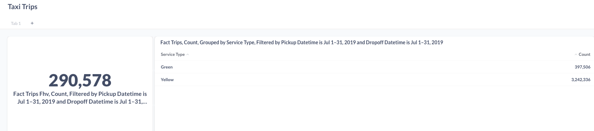

# Ingestion

Run `docker compose up pgdatabase pgadmin`
Run `docker ps` and grab container id for pgdatabase
Run `docker inspect <container id>` and grab `gateway` ip, add it on `load_data.py` 
Run `docker compose up ingestion --build`

Note there are some tweakings about the columsn to use, but I'm late to the deliver

FHV July 2019: 290576
Green July 2019: 397489
Yellow July 2019: 3242336

